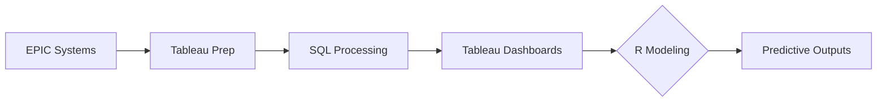
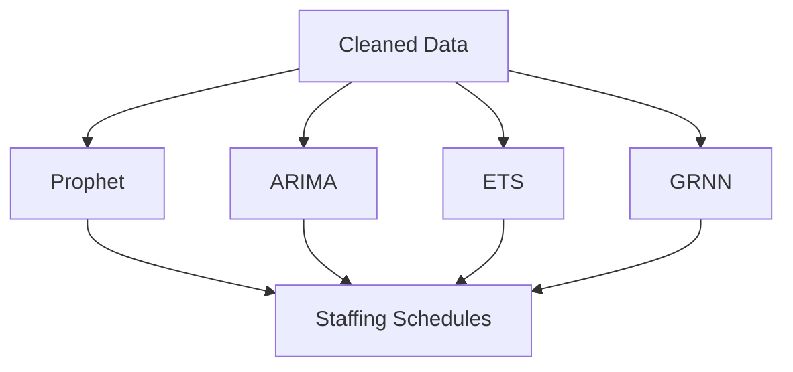

# Enhancing Call Center Efficiency Through Predictive Analytics and Staffing Optimization  
*Master's Project by: Richard Diazdeleon*

---

## 📑 Table of Contents  
1. [Executive Summary](#executive-summary)  
2. [Business Challenge](#business-challenge)  
3. [About the Data](#about-the-data)  
4. [Methodology](#methodology)  
5. [Modeling & Analysis](#modeling--analysis)  
6. [Conclusions](#conclusions)  
7. [Acknowledgments](#Acknowledgments)
8. [Literature Review](#Literature-Review)

---

### 1. Executive Summary 

#### Project Overview  
This research develops a predictive staffing model for healthcare call centers, combining:  
- **Operational analytics** (call patterns, handling times)  
- **AI forecasting** (Prophet, ARIMA/SARIMA, ETS)  
- **Dashboard integration** for real-time decision making  

#### Key Insights  
- **Peak Demand**: Monday-Wednesday call volumes (10%+ higher than weekends)  
- **Cost Drivers**: HR represents 70-80% of operational expenses  
- **Model Approach**:  
  > "Like musical chairs - optimizing FTE 'seats' across 8-hour shifts"  

#### Implementation Value  
- Reduces staffing costs while maintaining service levels  
- Scales for large organizations (500+ employees)  

---

### 2. Business Challenge 

#### Healthcare Context  
**Kaiser Permanente Case** (12.7M members):  
- Critical call center functions:  
  - ✓ Medical appointments  
  - ✓ Clinical advice  
  - ✓ Insurance processing  
  - ✓ Prescription management  
- **Pain Point**: 5% data volatility impacts staffing accuracy  

#### Research Hypotheses  

| Hypothesis                | Challenge                          | Solution Approach               |
|---------------------------|------------------------------------|---------------------------------|
| Biweekly Allocation       | Align FTEs with demand swings      | Model-driven FTE estimates      |
| Real-Time Robustness      | Handle data fluctuations           | Adaptive forecasting models     |

---

### 3. About the Data 

#### Data Sources
- **Origin**: 
  - Customer Care Database (CCDB)
  - Telephone Database (TDB)
  - Email Database (EDB)
- **Timeframe**: January - October 2024
- **Content**:
  - Call timestamps, durations, reasons (patient/routine/service)
  - Masked PHI (HIPAA-compliant anonymization)

#### ETL Pipeline

---

### 4. Methodology 

#### Call Volume Patterns
| Time Period          | Observation                           | Staffing Action                    |
|----------------------|---------------------------------------|------------------------------------|
| **Weekly Peaks**     | Highest volumes: Monday-Tuesday       | Increase RN/LVN shifts             |
| **Weekend**          | Sharp decrease: Saturday-Sunday       | Reduce staff                       |
| **Daily Peaks**      | 8 AM - 4 PM (Monday-Tuesday focus)    | Prioritize AM shifts               |
| **Overnight**        | Consistently low: 12 AM - 8 AM        | Minimal coverage                   |

#### Message Type Analysis
- **Longest Handling Time**:
  - Patient messages
  - Routine messages
  - Request messages

#### Seasonal Staffing Needs
- **Peak Demand (July-August)**:
  - Summer emergencies
  - Increased birth rates
  - Vacation coverage gaps
- **Steady Demand (Jan-Mar)**:
  - Flu season consistency

---

 ### 5. Modeling & Analysis 

#### Forecasting Framework
**Target**:  
Predict staffing needs \( S_t \) from:
- Daily `count`, `total_hrs`, and `AHT`  
- Message types: `Patient`, `Routine`, `Request`  

**Goals**:
1. Capture weekly/monthly trends  
2. Adjust for holidays and anomalies  
3. Optimize summer staffing  

#### Model Implementation
**Tools**:

---

### 6. Conclusions 

#### GRNN Value
- **Short-term**: Accurate biweekly forecasts for `S_t2_RN`/`S_t2_LVN`  
- **Non-linear**: Outperforms ARIMA/ETS on 14-day horizons  

#### Key Limitations
- **Extrapolation**: Struggles with long-term predictions  
- **Adoption**: R code complexity challenges analysts  

#### Improvement Path
1. **Technical**:  
   - Hybrid modeling (GRNN + decomposition)  
   - Sigma tuning
   - Ensemble methods with lag windows  

2. **Operational**:  
   - External regressors (department inputs)  
   - Simplified business translations  

#### Business Outcome  
*"Established short-term staffing baselines, with long-term adoption requiring:"*  
- Model refinements  
- Statistical training for teams

---

### Acknowledgments 

Thank you to everyone who supported my journey as a graduate student in Statistics at CSULB. It has been a pleasure to learn, grow, and collaborate with inspiring peers and faculty. A special thanks to:  

- **Dr. Moon**, **Dr. Joon**, and **Dr. Suaray**  
- All CSULB faculty who taught me to think critically and embrace statistical problem-solving  

Feel free to reach me at:  
📧 [Richard.Diazdeleon01@student.csulb.edu](mailto:Richard.Diazdeleon01@student.csulb.edu)  

---

### Literature Review 

1. **Heskett, J. L., Sasser, W. E., & Schlesinger, L. A.** (1997). *The service profit chain: How leading companies link service and profit.* Free Press.  

2. **Gross, D., & Harris, C.** (1998). *Fundamentals of queueing theory.* Wiley.  

3. **Avramidis, A. N., Chan, W., & L'Ecuyer, P.** (2004). Staffing multi-skill call centers via search methods and a performance approximation. *Annals of Operations Research, 127*, 225–244. [DOI](https://doi.org/10.1007/s10479-004-0561-7)  

4. **Gans, N., Koole, G., & Mandelbaum, A.** (2003). Telephone call centers: Tutorial, review, and research prospects. *Manufacturing & Service Operations Management, 5*(2), 79–141. [JSTOR](https://www.jstor.org/stable/30036696)  

5. **Aksin, Z., Armony, M., & Mehrotra, V.** (2007). The modern call center: A multi-disciplinary perspective on operations management research. *Production and Operations Management, 16*(6), 665–688. [DOI](https://doi.org/10.1287/msom.1060.0124)  

6. **Li, S., Chan, W., & L'Ecuyer, P.** (2018). Predicting call center performance with machine learning. In *Service Science: Research and Innovations in the Service Economy* (pp. 243–257). Springer. [DOI](https://doi.org/10.1007/978-3-030-04726-9_19)  

7. **McKinsey & Company.** (2022). *Smart scheduling: How to solve workforce-planning challenges with AI.* [URL](https://www.mckinsey.com/capabilities/operations/our-insights/smart-scheduling-how-to-solve-workforce-planning-challenges-with-ai)  

*(Add a synthesis paragraph here to connect references to your research.)*  

---
